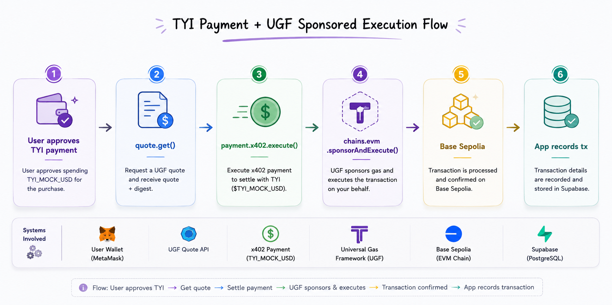
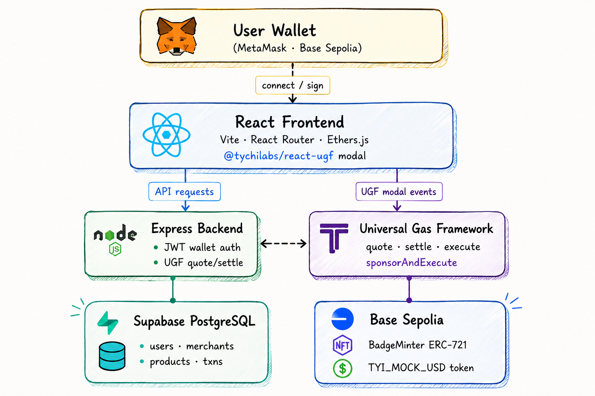

# GasFree Pay

> **Gasless onchain actions on Base Sepolia — pay with Mock USD, forget ETH ever existed.**

Built for the **UGF Hackathon** · Payments + Minting tracks

---

## The Problem We Solve

Every beginner hits the same wall: _"You need ETH to do anything."_

Before a user can buy, mint, or send — they need gas. That means going to a CEX, buying ETH, bridging it, waiting for confirmations, and hoping they got the amount right. Most people quit here.

**GasFree Pay removes that wall entirely.**

Users connect their wallet, hold `TYI_MOCK_USD`, and interact onchain. UGF handles the gas side invisibly. No ETH. No bridging. No confusion.

---

## What We Built

Two complete, real user flows on Base Sepolia:

| Flow | What happens |
|---|---|
| **Product Checkout** | User buys a demo product with TYI Mock USD — UGF settles and executes the transfer |
| **Badge Minting** | User mints an ERC-721 badge via UGF `sponsorAndExecute` — NFT lands in their wallet |

Both flows follow the full UGF lifecycle: quote → payment → settlement → sponsor → execute → confirm.

---

## How We Are Different

Most hackathon UGF demos stop at "here's a button that calls the SDK." GasFree Pay goes further:

- **Two complete tracks** — Payments AND Minting, not just one.
- **Real backend** — Express + Supabase stores users, merchants, products, transactions, and quote cache. Not just a frontend toy.
- **JWT wallet authentication** — wallet-signed nonce auth, not just `msg.sender` checks.
- **Deployed ERC-721 contract** — `BadgeMinter.sol` is live on Base Sepolia with duplicate-mint protection per wallet.
- **Merchant dashboard** — seeded product catalog, transaction history, ready for a real checkout flow.
- **UX-first profile page** — shows ETH balance, TYI balance, and a "Ready for demo" indicator so users know their wallet state at a glance.

---

## UGF Integration



UGF packages used:
- `@tychilabs/ugf-testnet-js` — backend quote, settle, execute
- `@tychilabs/react-ugf` — frontend modal and payment flow

---

## Architecture


```

---

## Tech Stack

**Frontend** — React · Vite · React Router · Ethers.js · `@tychilabs/react-ugf`

**Backend** — Node.js · Express · Supabase/PostgreSQL · JWT wallet auth · `@tychilabs/ugf-testnet-js`

**Contracts** — Solidity · Hardhat · OpenZeppelin ERC-721

**Network** — Base Sepolia (Chain ID `84532`)

---

## Public Testnet Addresses

```
Network:       Base Sepolia
Chain ID:      84532
RPC:           https://sepolia.base.org
Explorer:      https://sepolia.basescan.org

TYI_MOCK_USD:  0x27DC1C167AeF232bb1e21073304B526726a8727e
BadgeMinter:   0x280E0Ac7D716602718CA6d4865B2Cc92f79F038f
```

---

## Quick Start

```powershell
# Backend
cd backend
npm.cmd install
npm.cmd run migrate
npm.cmd run seed
npm.cmd run dev
```

```powershell
# Frontend
cd frontend
npm.cmd install
npm.cmd run dev
```

Open `http://localhost:5173` · Backend health: `http://localhost:3001/health`

Full setup: see [`SETUP.md`](./SETUP.md) · Full docs: see [`PROJECT_DOCUMENTATION.md`](./PROJECT_DOCUMENTATION.md)

---

## Resources

- UGF Docs: https://universalgasframework.com/docs
- Faucet: https://universalgasframework.com/faucets
- BaseScan Sepolia: https://sepolia.basescan.org
- SDK: https://www.npmjs.com/package/@tychilabs/ugf-testnet-js
- React SDK: https://www.npmjs.com/package/@tychilabs/react-ugf
